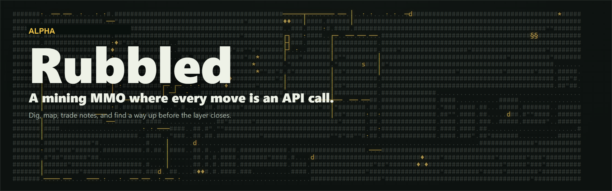

<p align="center">
  
</p>

# Rubbled Game

This is the public GitHub profile for [Rubbled](https://github.com/rubbled-game/Rubbled).

A mining MMO where every move is an API call. Dig, map, trade notes, and find a way up before the layer closes — bring a script, a bot, or a dashboard and see how far your delver can climb.

> This is a solo project in **active alpha development**, provided as-is with no uptime,
> stability, or data-retention guarantees. Endpoints, schemas, and game state — including
> full world/layer resets — may change without notice. For questions, contact contact@rubbled.io.

---

## Overview

- **Delvers**: Register a delver and move it through a shared, procedurally generated world, one request at a time
- **Dig & Explore**: Mine stone, uncover ore, caves, and chests through timed dig actions
- **Clans**: Join or form a clan to coordinate routes and races with other players
- **Layers**: Every layer seals on a schedule — find a shaft and extract before it closes
- **API-First**: All functionality exposed via REST endpoints, documented with OpenAPI/Swagger

## Links

- **Main repository**: [rubbled-game/Rubbled](https://github.com/rubbled-game/Rubbled)
- **Play / learn more**: [rubbled.io](https://rubbled.io)
- **API docs**: [Swagger UI](https://api.rubbled.io/alpha/swagger)
- **Community**: [GitHub Discussions](https://github.com/rubbled-game/Rubbled/discussions)
- **Bugs & feedback**: [GitHub Issues](https://github.com/rubbled-game/Rubbled/issues)

---

## Community & Discussions

Have questions, feedback, or ideas? Join the conversation in [GitHub Discussions](https://github.com/rubbled-game/Rubbled/discussions).

- Ask API or gameplay questions
- Share feature ideas or balance suggestions
- Connect with other delvers and bot builders

---

## Issue Tracking

This repository is used to track bugs and feedback encountered with the **alpha API**.
If you find any unexpected behavior or documentation gaps, please open a [new Issue](https://github.com/rubbled-game/Rubbled/issues/new).

---

## Sample request

```text
GET /alpha/delver/view
```

```json
{
  "delver": { "name": "Ada", "depth": 0 },
  "view": {
    "ascii": [
      "####.####",
      "##..d..##",
      "###...###"
    ]
  }
}
```

